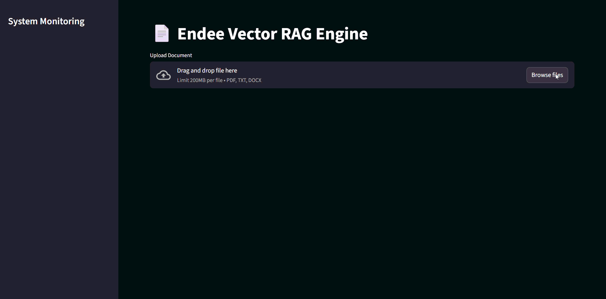
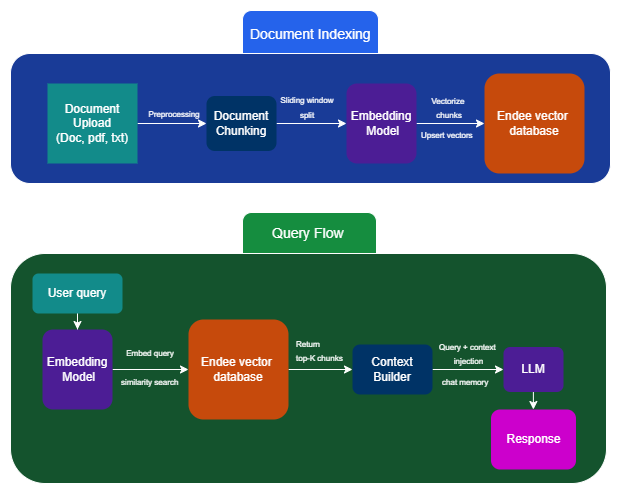

# RAG Chatbot with Endee Vector Database



A Retrieval-Augmented Generation (RAG) chatbot built as an extension of the Endee vector database. It uses Endee to store embeddings, Google Gemini for embeddings and generation, and Streamlit for the web UI.

---

## Features
- Upload PDFs, TXT, and DOCX files
- Live indexing & query performance metrics in UI
- Per-document vector index (each file gets its own Endee index)
- Cached vector ↔ chunk mapping for fast retrieval
- Context-aware chat (uses last N interactions for memory)


---

## Architecture


## Tech Stack

**Backend & Core**
- Endee – Vector database
- Google Gemini – Embeddings & LLM generation
- Python – Application logic

**Frontend**
- Streamlit – Web UI

**Infrastructure**
- Docker – Containerized deployment
- WSL 2 – Local Linux runtime

## Setup

1. Docker Installation

    Install docker based on your OS: [Windows](https://docs.docker.com/desktop/setup/install/windows-install/), [Mac](https://docs.docker.com/desktop/setup/install/mac-install/), [Linux](https://docs.docker.com/desktop/setup/install/linux/)

    If you are on windows you will need to install wsl2 to run it.\
    Open **PowerShell as Administrator** and run:

    ```powershell
    wsl --install
    ```
    Restart your system.\
    Check WSL version:

    ```powershell
    wsl --status
    ```

2. Run Endee with Docker

    1. Pull the Endee Docker Image

        ```bash
        docker pull endee/endee:latest
        ```
    2. Run Endee Container

        ```bash
        docker run -d --name endee -p 8080:8080 endee/endee:latest
        ```

    Endee will be available at:

    ```bash
    http://localhost:8080
    ```

3. Clone the repository:
    ```bash
    git clone https://github.com/Hrrsh-Gupta/endee.git
    ```

4. Create a virtual environment:
    ```bash
    python -m venv venv
    ```

5. Activate the virtual environment:
   
   **For Windows:**
   ```bash
   .\venv\Scripts\activate
   ```
   **For Linux/Mac:**
   ```bash
   source venv/bin/activate
   ```
   
6. Install the packages:
    ```bash
    pip install -r requirements.txt
    ```

7. Google Gemini API-Key

   Create a .env file in the root folder of the repo and paste the command with your key in it.
    ```bash
    GOOGLE_API_KEY = " paste the key here"
    ```
    If you do not have a key, get a free one at [Google AI Studio](https://aistudio.google.com/api-keys).
    
8. Run the app

    ```bash
    streamlit run app/main.py
    ```

## License

This repository is a fork of Endee and remains licensed under the
**Apache License 2.0**.

All original Endee components and additional RAG application code
in this repository follow the same license.

See the LICENSE file for full terms.

---

## Acknowledgements

This project is built on top of the following tools and platforms:

- **Endee.** — for providing a fast, open-source vector database used as the retrieval layer.
- **Google AI Studio** — for embeddings and LLM-powered text generation.
- **Streamlit** — for the simple and interactive UI used to build the RAG interface.


